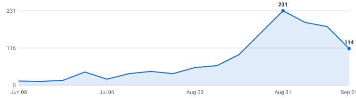

# 🎓 Summer 2027 Tech Internships

**A self-updating engine that tracks tech internships so you don't have to.**

&nbsp;&nbsp;&nbsp;

### 117 open roles (107 listed below) · 30 new this week

3,969 employers tracked · updated Aug 06, 2026 at 14:08 UTC

_67 have a cycle the employer stated · 50 are recent postings whose cycle isn't stated (listed separately, never mixed in)._

**[🖥️ Live dashboard](https://zshah101.github.io/Automated-List-Of-Summer-2027-and-Fall-2026-Tech-Internships/)** · **[📡 RSS](https://zshah101.github.io/Automated-List-Of-Summer-2027-and-Fall-2026-Tech-Internships/feed.xml)** · **[⚙️ JSON API](https://zshah101.github.io/Automated-List-Of-Summer-2027-and-Fall-2026-Tech-Internships/api/jobs.json)** · **[✉️ Email alerts](https://zshah101.github.io/Automated-List-Of-Summer-2027-and-Fall-2026-Tech-Internships/#subscribe)**

> [!TIP]
> **⭐ Star this repo** to save it and get updates when new roles are added.

Instead of refreshing a dozen career pages by hand, it reads company hiring feeds directly and keeps one live list — newest roles on top, refreshed automatically throughout the day.

**🔔 New roles in your inbox:** [subscribe by email](https://zshah101.github.io/Automated-List-Of-Summer-2027-and-Fall-2026-Tech-Internships/#subscribe) - one email a day, only when new internships actually appeared, unsubscribe from any email in two clicks. (Prefer RSS-to-email? [Feedrabbit works too](https://feedrabbit.com/subscriptions/new?url=https%3A%2F%2Fraw.githubusercontent.com%2Fzshah101%2FAutomated-List-Of-Summer-2027-and-Fall-2026-Tech-Internships%2Fmain%2Fdocs%2Ffeed.xml).)

---

## What this is

This is an engine, not a hand-kept list. It polls company career feeds every 30 minutes, finds the internships, removes duplicates, and rebuilds this page on its own.

Every link comes straight from the source — so it's real and current, not a stale list someone forgot to update. Speed matters.

## What makes this different

| | |
|---|---|
| 📅 **[Drop Radar](#drop-radar)** | A forecast of **what's coming**. Each marquee company's typical opening window, replaced by the real drop date the moment the engine catches it live. Windows are estimates and labelled as such; only dates the engine saw itself are marked verified. |
| 🛂 **Visa intel, computed** | 🇺🇸 / 🛂 flags detected automatically from every job description, plus ✓ for employers with a real H-1B track record (USCIS data, FY2022-23 — a history, not a promise). The big lists crowdsource this by hand; here it's code. Most postings say nothing either way, and those show as unknown rather than guessed. |
| 📆 **A real date on nearly every role** | Taken from the job portal itself wherever the portal states one, so newest-first actually means newest. The exact coverage figure is printed at the bottom of this page every run. |
| 🧰 **Skill tags + pay, extracted** | Every posting's text is scanned for the stack it wants (Python, C++, PyTorch, …) and the pay it states — searchable on the [dashboard](https://zshah101.github.io/Automated-List-Of-Summer-2027-and-Fall-2026-Tech-Internships/), and included in the CSV and API. |
| 🔔 **Alerts your way** | [Email digests](https://zshah101.github.io/Automated-List-Of-Summer-2027-and-Fall-2026-Tech-Internships/#subscribe) or [RSS](https://zshah101.github.io/Automated-List-Of-Summer-2027-and-Fall-2026-Tech-Internships/feed.xml) — point any reader, or a Slack/Discord RSS integration, at it. Plus a [live dashboard](https://zshah101.github.io/Automated-List-Of-Summer-2027-and-Fall-2026-Tech-Internships/) with search, filters, and a saved-roles list that never leaves your browser. |
| ⚙️ **An engine, not a spreadsheet** | 4,066 job-board endpoints (3,969 distinct employers; some run more than one board) polled every 30 minutes across 12 ATS platforms. Full source and tests in this repo. |

## Scope

| | |
|---|---|
| **Roles** | Software Engineering, Data Science & Machine Learning (and closely related technical internships) |
| **Region** | United States |
| **Cycles** | Summer 2027 and Fall 2026 |

## About

I'm an international student studying in the United States, so I built this for the search I'm doing myself. The list is US roles only for now — that's where I'm searching.

Use it to spot roles early and apply before they fill up. Being first genuinely helps.

## Where this is going

I'm building this in the open and adding to it as it grows.

**Recently shipped:** email alerts · the Drop Radar · auto-detected sponsorship flags · the live dashboard

**Next up:** personalized alerts (pick your categories) · per-company hiring pages · a ghost-posting detector

If it helps you, a star means a lot and tells me to keep going.

## How to use

<b>Reading the table — flags, dates, and the cycle split</b> (click to expand)

- Roles are grouped by cycle below - **newest posting on top, oldest at the bottom.**
- A cycle section holds only roles whose **employer stated that cycle** - in the title, or in the posting's own text. Postings that name no cycle anywhere are in *Recently posted — cycle not stated* further down, with **no cycle guessed for them**. Same quality bar, different amount of evidence.
- The **Posted** column is the date the company published the role.
- **🆁 after a company name** = **this role is remote** — the posting's own location or title says so. It marks the role on that row, not the whole company.
- **Flags after a role title:** 🇺🇸 = requires U.S. citizenship or a security clearance · 🛂 = the posting says it won't sponsor a work visa · 🆕 = spotted in the last 48 hours. Sponsorship flags are detected automatically from each job description - treat them as a strong hint and confirm on the posting.
- **✓ after a company name** = a real H-1B track record: USCIS approved 10+ petitions for that employer in FY2022–2023 (matched automatically against the official [H-1B Employer Data Hub](https://www.uscis.gov/tools/reports-and-studies/h-1b-employer-data-hub)). No ✓ doesn't mean they won't sponsor - it means we can't prove they have.
- Track your applications with [`data/internships.csv`](data/internships.csv) (opens in Excel / Google Sheets).
- Missing a company? Adding one takes a single line, see [CONTRIBUTING.md](CONTRIBUTING.md).

---

## Summer 2027  (39 employer-stated)

| Company | Role | Category | Location | Skills | Posted | Apply |
|---|---|---|---|---|---|---|
| Northrop Grumman | 2027 Intern Software Engineer 🇺🇸 🆕 | Software | United States-Florida-Melbourne | No skills listed | Aug 05, 2026 | [Apply](https://ngc.wd1.myworkdayjobs.com/Northrop_Grumman_External_Site/job/United-States-Florida-Melbourne/XMLNAME-2027-Intern-Software-Engineer_R10243573) |
| Regions Bank ✓ | 2027 ETP Intern – Corporate Banking Group, Commercial Credit Products, Mobile, AL 🛂 🆕 | Software | Mobile, AL - RSA Tower | No skills listed | Aug 05, 2026 | [Apply](https://regions.wd5.myworkdayjobs.com/regions_careers/job/Mobile-AL---RSA-Tower/XMLNAME-2027-ETP-Intern---Corporate-Banking-Group--Commercial-Credit-Products--Mobile--AL_R104975) |
| Roblox ✓ | [Summer 2027] Software Engineer Intern 🆕 | Software | San Mateo, CA, United States | Python, Java, C++, C# | Aug 05, 2026 | [Apply](https://careers.roblox.com/jobs/8072713?gh_jid=8072713) |
| Pentair | IT & Cybersecurity Leadership Development Internship Program -  Summer 2027 🛂 | Security | Golden Valley, MN | No skills listed | Aug 03, 2026 | [Apply](https://pentair.wd5.myworkdayjobs.com/pentair_careers/job/Golden-Valley-MN/IT---Cybersecurity-Leadership-Development-Internship-Program----Summer-2027_R23700) |
| CNO Financial Group 🆁 | Artificial Intelligence (AI) IT Intern 2027 - REMOTE | Data & ML/AI | Carmel, IN | No skills listed | Aug 03, 2026 | [Apply](https://cnoinc.wd5.myworkdayjobs.com/Careers/job/Carmel-IN/Artificial-Intelligence--AI--IT-Intern-2027---REMOTE_JR170389) |
| CNO Financial Group 🆁 | Cyber Security IT Intern - REMOTE | Security | Carmel, IN | Python | Aug 03, 2026 | [Apply](https://cnoinc.wd5.myworkdayjobs.com/Careers/job/Carmel-IN/Cyber-Security-IT-Intern---REMOTE_JR170419) |
| Chicago Trading Company | Software Engineering Internship - Summer 2027 | Software | Chicago, Illinois, United States | Python, Java, C++ | Aug 03, 2026 | [Apply](https://job-boards.greenhouse.io/chicagotradingcampus/jobs/4716932005) |
| Netsmart | Software Engineer Intern (Summer 2027 Internship) | Software | Overland Park, KS | Java, C++, C# | Aug 03, 2026 | [Apply](https://ntst.wd1.myworkdayjobs.com/careers/job/Overland-Park-KS/Software-Engineer-Intern--Summer-2027-Internship-_R015667) |
| HPR (Hyannis Port Research) | Software Engineering Intern - Summer 2027 | Software | Needham, MA | Python, Java, Linux | Aug 01, 2026 | [Apply](https://job-boards.greenhouse.io/hyannisportresearch/jobs/7822989003) |
| Melius | Software Engineering Intern [Spring/Summer 2027] | Software | New York City | TypeScript, LLMs, React, PostgreSQL | Jul 31, 2026 | [Apply](https://jobs.ashbyhq.com/melius/b61f063a-4f94-4e50-a4ef-05aaab552280) |
| Heliux | Software Engineer (Internship, Summer 2027) 🇺🇸 | Software | HQ (San Francisco, CA) | Python, Java, Rust, TypeScript | Jul 31, 2026 | [Apply](https://jobs.ashbyhq.com/heliux/ff2b6f4b-00d0-4afe-b4f5-2dbf443409ef) |
| Virtu Financial ✓ | 2027 Internship - Frontend Engineer (UI) | Software | New York | Python, Java, C++, TypeScript | Jul 29, 2026 | [Apply](https://job-boards.greenhouse.io/virtu/jobs/8657500002) |
| Appian ✓ | Information Security Engineer Intern 🛂 | Security | McLean, Virginia | LLMs | Jul 27, 2026 | [Apply](https://job-boards.greenhouse.io/appian/jobs/8088496) |
| Northrop Grumman | 2027 Returning Intern Software Engineer 🇺🇸 | Software | United States-Florida-Melbourne | No skills listed | Jul 27, 2026 | [Apply](https://ngc.wd1.myworkdayjobs.com/Northrop_Grumman_External_Site/job/United-States-Florida-Melbourne/XMLNAME-2027-Returning-Intern-Software-Engineer_R10242378) |
| PDT Partners | Summer 2027 Software Engineering Intern | Software | New York, NY | No skills listed | Jul 24, 2026 | [Apply](https://job-boards.greenhouse.io/pdtpartners/jobs/8077685) |
| Quadrillion | Software Engineering Intern (Summer 2027) | Software | New York City | Python, Pandas, React | Jul 24, 2026 | [Apply](https://jobs.ashbyhq.com/quadrillion-labs/a4acc44c-31ce-41a0-ab44-2500487b4d05) |
| Anthelion Capital | Quant Developer / Quant Research Intern - 2026/2027 | Quant | New York City | Python, C++, Rust, Azure | Jul 23, 2026 | [Apply](https://jobs.ashbyhq.com/anthelioncap/5e2ea37b-2369-474e-b717-c24c60976e96) |
| Appian ✓ | Software Engineering Intern 🛂 | Software | McLean, Virginia | LLMs | Jul 23, 2026 | [Apply](https://job-boards.greenhouse.io/appian/jobs/8041237) |
| Virtu Financial ✓ | 2027 Internship - Software Engineer | Software | Austin, TX; New York | Python, Java, C++, JavaScript | Jul 21, 2026 | [Apply](https://job-boards.greenhouse.io/virtu/jobs/8624410002) |
| Axon ✓ | RenderATL - 2027 US Software Engineering Internship | Software | Seattle, Washington, United States | Python, Java, C#, SQL | Jul 20, 2026 | [Apply](https://job-boards.greenhouse.io/axontalentcommunity/jobs/7800617003) |
| Axon ✓ | RenderATL 2027 US Firmware Engineering Internship | Hardware | Seattle, Washington, United States | Python, C++, Go, Rust | Jul 20, 2026 | [Apply](https://job-boards.greenhouse.io/axontalentcommunity/jobs/7800628003) |
| Western Digital ✓ | Summer 2027 - Software Engineering Internship | Software | San Jose, CA, United States | Python, Java, C++, Go | Jul 20, 2026 | [Apply](https://jobs.smartrecruiters.com/WesternDigital/744000138727213) |
| Chicago Trading Company | Software Engineering Internship - Summer 2027 | Software | Chicago, Illinois, United States | Python, Java, C++ | Jul 20, 2026 | [Apply](https://job-boards.greenhouse.io/ctccampusboard/jobs/4708230005) |
| Deepgram 🆁 | Software Engineering- Internship (Fall 2026/Summer 2027) _(also open for Fall 2026)_ | Software | USA / Remote | LLMs | Jul 17, 2026 | [Apply](https://jobs.ashbyhq.com/deepgram/dc8693b5-72ce-4ca3-ab15-9c8434d35da1) |
| Chevron Corporation ✓ | 2026-2027 Information Technology - Software Engineer - Intern 🛂 | Software | Houston, Texas, United States of America | Python, Java, C#, TypeScript | Jul 16, 2026 | [Apply](https://chevron.wd5.myworkdayjobs.com/University/job/Houston-Texas-United-States-of-America/XMLNAME-2026-2027-Information-Technology---Software-Engineer---Intern_R000072398-1) |
| Old Mission Capital | Software Engineer – 2027 Internship Program (June Start) | Software | Chicago, IL, United States | Python, C++, TypeScript | Jul 15, 2026 | [Apply](https://www.oldmissioncapital.com/careers/?gh_jid=7796180003) |
| The Trade Desk ✓ | 2027 North America Software Engineering Internship | Software | Bellevue +5 more | No skills listed | Jul 15, 2026 | [Apply](https://job-boards.greenhouse.io/thetradedesk/jobs/5187605007) |
| Five Rings | Summer Intern 2027 - Software Developer | Software | New York | Python, C++, Linux | Jul 14, 2026 | [Apply](https://job-boards.greenhouse.io/fiveringsllc/jobs/5349707008) |
| Akuna Capital ✓ | Software Engineer Intern - C++, Summer 2027 | Software | Chicago, IL | C++, Python | Jul 13, 2026 | [Apply](https://www.akunacapital.com/careers/job/8018847/?gh_jid=8018847) |
| Akuna Capital ✓ | Software Engineer Intern - Python, Summer 2027 | Software | Chicago, IL | Python | Jul 13, 2026 | [Apply](https://www.akunacapital.com/careers/job/8018853/?gh_jid=8018853) |
| Akuna Capital ✓ | Platform Engineer Intern, Summer 2027 | Software | Chicago, IL | AWS, Kubernetes | Jul 13, 2026 | [Apply](https://www.akunacapital.com/careers/job/8018856/?gh_jid=8018856) |
| Hudson River Trading ✓ | Software Engineering Internship (C++ or Python) – Summer 2027 | Software | Austin +11 more | Python, C++ | Jul 13, 2026 | [Apply](https://www.hudsonrivertrading.com/careers/job/?gh_jid=8052083) |
| Tower Research Capital ✓ | Quantitative Developer Intern - Summer 2027 | Quant | New York, Chicago | Python, C++, Linux | Jul 05, 2026 | [Apply](https://www.tower-research.com/open-positions/?gh_jid=8044334) |
| IMC Trading ✓ | Software Engineer Intern - Summer 2027 | Software | Chicago, United States | Java, C++ | Jul 01, 2026 | [Apply](https://job-boards.eu.greenhouse.io/imc/jobs/4823924101) |
| IMC Trading ✓ | Machine Learning Research Intern - Summer 2027 - Chicago | Data & ML/AI | Chicago, United States | Python, PyTorch, TensorFlow | Jul 01, 2026 | [Apply](https://job-boards.eu.greenhouse.io/imc/jobs/4907430101) |
| Voloridge | Quantitative Developer Intern 2027 | Quant | Jupiter, FL | Python, C++, C#, SQL | Jun 11, 2026 | [Apply](https://job-boards.greenhouse.io/voloridgeinvestmentmanagement/jobs/4224862009) |
| Anduril | 2027 Software Engineer Intern 🇺🇸 | Software | Atlanta +17 more | Python, Java, C++, Rust | Jun 10, 2026 | [Apply](https://boards.greenhouse.io/andurilindustries/jobs/5148079007?gh_jid=5148079007) |
| Walleye Capital | Quantic – Quantitative Developer Intern (Summer 2027) | Quant | Boston, MA | Python, PyTorch, TensorFlow, scikit-learn | Jun 01, 2026 | [Apply](https://job-boards.greenhouse.io/walleyecapital-external-students/jobs/4679168006) |
| Ellipsis Labs | Software Engineer - 2027 Interns | Software | New York, New York | Python, Java, C++, Rust | Mar 26, 2026 | [Apply](https://jobs.ashbyhq.com/ellipsislabs/02136b22-35b1-4b3d-8bef-567c3380a849) |

## Fall 2026  (25 employer-stated)

| Company | Role | Category | Location | Skills | Posted | Apply |
|---|---|---|---|---|---|---|
| NVIDIA ✓ | Software Engineering Intern, Dynamo - Fall 2026 🆕 | Software | US, CA, Santa Clara | Python, Go, Rust, LLMs | Aug 05, 2026 | [Apply](https://nvidia.wd5.myworkdayjobs.com/NVIDIAExternalCareerSite/job/US-CA-Santa-Clara/Software-Engineering-Intern--Dynamo---Fall-2026_JR2022295) |
| Densityai | Technical Intern- Software  (Fall 2026) 🇺🇸 🆕 | Software | Mountain View, CA | Python, C++ | Aug 03, 2026 | [Apply](https://job-boards.greenhouse.io/densityai/jobs/4336452009) |
| Melius | Software Engineering Intern [Fall/Winter 2026] | Software | New York City | TypeScript, LLMs, React, PostgreSQL | Jul 30, 2026 | [Apply](https://jobs.ashbyhq.com/melius/6a944911-dbbf-44c7-ba52-7866f7b433cf) |
| Sony Pictures Entertainment ✓ | Current Programming Intern, Sony Pictures Television – Fall 2026 | Software | Culver City, California | No skills listed | Jul 29, 2026 | [Apply](https://spe.wd1.myworkdayjobs.com/SonyPicturesEntertainment/job/Culver-City-California/Current-Programming-Intern--Sony-Pictures-Television---Fall-2026_JR113893) |
| Redwood Materials | Embedded Software Engineer Intern - Fall 2026 | Software | San Francisco, California, United States | C++, Rust, Git | Jul 29, 2026 | [Apply](https://boards.greenhouse.io/redwoodmaterials/jobs/6126784004?gh_jid=6126784004) |
| Astranis | Software Engineer Intern - Enterprise Systems (Fall 2026) 🇺🇸 | Software | San Francisco, CA | Python | Jul 23, 2026 | [Apply](https://job-boards.greenhouse.io/astranis/jobs/4699071006) |
| Rendezvous Robotics | Software Engineering Intern (Fall 2026) 🇺🇸 | Software | Golden, CO | Python, C++, Linux | Jul 22, 2026 | [Apply](https://job-boards.greenhouse.io/rendezvousrobotics/jobs/4328555009) |
| Deepgram 🆁 | Software Engineering- Internship (Fall 2026/Summer 2027) _(also open for Summer 2027)_ | Software | USA / Remote | LLMs | Jul 17, 2026 | [Apply](https://jobs.ashbyhq.com/deepgram/dc8693b5-72ce-4ca3-ab15-9c8434d35da1) |
| Moog | Intern, IT Computer Science - Data Analytics | Data & ML/AI | Buffalo, NY | No skills listed | Jul 16, 2026 | [Apply](https://moog.wd5.myworkdayjobs.com/moog_external_career_site/job/Buffalo-NY/Intern--IT-Computer-Science---Data-Analytics_R-26-17145) |
| NVIDIA ✓ | Applied Research Intern, NLP - Fall 2026 | Data & ML/AI | US, CA, Santa Clara | Python, PyTorch | Jul 01, 2026 | [Apply](https://nvidia.wd5.myworkdayjobs.com/NVIDIAExternalCareerSite/job/US-CA-Santa-Clara/Applied-Research-Intern--NLP---Fall-2026_JR2010488) |
| Junior | Software Engineering Intern — Fall 2026 🇺🇸 | Software | New York City | TypeScript, JavaScript, LLMs | Jun 30, 2026 | [Apply](https://jobs.ashbyhq.com/junior/23ee686b-d305-4ac9-860d-16c99ddb4891) |
| Figure | Firmware Intern [Fall 2026] | Hardware | San Jose, CA | Python, C++ | Jun 22, 2026 | [Apply](https://job-boards.greenhouse.io/figureai/jobs/4691070006) |
| Intuitive Surgical ✓ | Computer Vision Engineering Intern - Fall 2026 | Data & ML/AI | Sunnyvale, CA, United States | Computer Vision, Python, C++, PyTorch | Jun 22, 2026 | [Apply](https://jobs.smartrecruiters.com/Intuitive/744000133458290) |
| SoloPulse | Software Engineer Intern/Co-Op - Fall 2026 | Software | Peachtree Corners, GA | Python, C++, PyTorch, CUDA | Jun 16, 2026 | [Apply](https://jobs.lever.co/solopulseco/00fbde18-a387-4c9f-97d4-77059aec7b56) |
| Beacon Software | Software Engineering Intern | Software | San Francisco, CA | Python, TypeScript, LLMs, PostgreSQL | Jun 02, 2026 | [Apply](https://jobs.ashbyhq.com/beaconsoftware/2452d342-a069-4eda-adbe-9df296808ca1) |
| Saronic | Software Engineer Intern (Fall 2026) 🇺🇸 | Software | Austin, TX | Python, C++, Rust, TypeScript | May 18, 2026 | [Apply](https://jobs.ashbyhq.com/saronic/1c74957f-0895-415b-9324-08b0994747d7) |
| Astranis | Software Engineer- Backend Intern (Fall 2026) 🇺🇸 | Software | San Francisco, CA | Python, Kubernetes, PostgreSQL | May 13, 2026 | [Apply](https://job-boards.greenhouse.io/astranis/jobs/4681183006) |
| Amazon ✓ | Software Development Engineer Intern, AWS Data Services - Fall 2026 (US) | Data & ML/AI | Seattle, Washington, USA | Python, Java, C++, C# | May 06, 2026 | [Apply](https://www.amazon.jobs/en/jobs/10412530/software-development-engineer-intern-aws-data-services-fall-2026-us) |
| TMEIC ✓ | Intern - Applications, AI and Machine Learning (Fall 2026) (ET26021) 🛂 | Data & ML/AI | Roanoke, Virginia, United States | No skills listed | Apr 24, 2026 | [Apply](https://apply.workable.com/tmeic-corporation-americas/j/FD4C9770FF/) |
| Lego | Firmware Engineering Co-Op - Fall 2026 | Hardware | United States of America | Python | Apr 20, 2026 | [Apply](https://lego.wd103.myworkdayjobs.com/lego_executive/job/Boston-Hub/Firmware-Engineering-Intern_0000031568) |
| SharkNinja ✓ | Fall 2026: SharkByte Applied AI & Analytics Co-op (July/August to December) | Data & ML/AI | Miami +8 more | Python, SQL, LLMs, AWS | Apr 02, 2026 | [Apply](https://job-boards.greenhouse.io/sharkninjaoperatingllc/jobs/4669676006) |
| Hermeus | Software Engineering Intern (Command & Control) - Fall 2026 🇺🇸 | Software | Atlanta, GA | C++, TypeScript, JavaScript, React | Apr 01, 2026 | [Apply](https://jobs.lever.co/hermeus/a3a1f0ea-6a4f-42e5-81c8-3b34dac22a67) |
| Hermeus | Flight Software Engineering Intern - Fall 2026 🇺🇸 | Software | Atlanta, GA | C++ | Mar 04, 2026 | [Apply](https://jobs.lever.co/hermeus/51378fa0-0327-45fd-9420-b6e7d8b56440) |
| Amazon ✓ | Robotics - Software Development Engineer Intern/Co-op - 2026 | Hardware | Westboro, Massachusetts, USA | Python, Java, C++, C# | Dec 03, 2025 | [Apply](https://www.amazon.jobs/en/jobs/3136266/robotics-software-development-engineer-intern-co-op-2026) |
| Amazon ✓ | Amazon Industrial Robotics - Applied Scientist II Intern / Co-op - 2026, Amazon Industrial Robotics | Data & ML/AI | North Reading, Massachusetts, USA | Python, Java, C++, LLMs | Nov 25, 2025 | [Apply](https://www.amazon.jobs/en/jobs/3132414/amazon-industrial-robotics-applied-scientist-ii-intern-co-op-2026-amazon-industrial-robotics) |

## Recently posted — cycle not stated  (44 roles)

These postings never name a cycle — not in the title, not in the posting text — so neither do we. They're recent tech internships (posted within the last few weeks), often exactly the early drops worth applying to first; we just can't tell you which cycle they're for, and we'd rather say so than guess. The moment a posting's own text states a cycle, the role moves up into that section automatically.

| Company | Role | Category | Location | Skills | Posted | Apply |
|---|---|---|---|---|---|---|
| impact.com | Associate Software Engineer intern 🆕 | Software | Santa Barbara, CA | Java, JavaScript, React, Angular | Aug 06, 2026 | [Apply](https://job-boards.greenhouse.io/impact/jobs/8645964002) |
| KBR ✓ | Software Intern 🆕 | Software | Houston, Texas | Python, C#, JavaScript, HTML/CSS | Aug 06, 2026 | [Apply](https://kbr.wd5.myworkdayjobs.com/KBR_Careers/job/Houston-Texas/Software-Intern_R2127863) |
| Draper | Embedded Quality & Fielded Systems Intern 🆕 | Software | Cambridge, MA | Python, C# | Aug 05, 2026 | [Apply](https://draper.wd5.myworkdayjobs.com/Draper_Careers/job/Cambridge-MA/Embedded-Quality---Fielded-Systems-Intern_JR002718) |
| Thales | AppSec Product Support Intern 🆕 | Security | Texas | No skills listed | Aug 04, 2026 | [Apply](https://thales.wd3.myworkdayjobs.com/careers/job/Texas/AppSec-Product-Support-Intern_R0328978-1) |
| Diversified Automation | Software Engineering Co-op 🆕 | Software | Louisville, KY | No skills listed | Aug 04, 2026 | [Apply](https://jobs.lever.co/diversified-automation/827a092d-b8a3-4ca9-a84a-e8c236d1aabc) |
| IDEXX ✓ | Security Operations (Cybersecurity) internship | Security | Westbrook, ME | No skills listed | Aug 03, 2026 | [Apply](https://idexx.wd1.myworkdayjobs.com/IDEXX/job/Westbrook-ME/Security-Operations--Cybersecurity--internship_J-053268) |
| Microchip Technology ✓ | Intern-Engineering (Firmware Development) | Hardware | TX - Houston - Compaq Center Dr | Python, Java, C++, C# | Aug 03, 2026 | [Apply](https://microchiphr.wd5.myworkdayjobs.com/external/job/TX---Houston---Compaq-Center-Dr/Intern-Engineering--Firmware-Development-_R3372-26) |
| Bosch ✓ | AI and SW Development Engineering Intern | Data & ML/AI | Plymouth, MI, United States | Python, C++, Computer Vision, Git | Aug 03, 2026 | [Apply](https://jobs.smartrecruiters.com/BoschGroup/744000141302469) |
| Microchip Technology ✓ | Intern-Engineering (Software Development) | Software | TX - Houston - Compaq Center Dr | Python, Java, C++, C# | Aug 03, 2026 | [Apply](https://microchiphr.wd5.myworkdayjobs.com/external/job/TX---Houston---Compaq-Center-Dr/Intern-Engineering--Software-Development-_R3371-26) |
| Yotta Labs | Research Engineer Intern - AI Systems | Data & ML/AI | United States | Python, C++, PyTorch, LLMs | Aug 02, 2026 | [Apply](https://jobs.ashbyhq.com/yotta/09821a51-fbe6-42a7-a566-0d2b5d40fae3) |
| Copart ✓ | Software Engineering Intern | Software | Dallas, TX - Headquarters | Python, Java, TypeScript, JavaScript | Aug 02, 2026 | [Apply](https://copart.wd12.myworkdayjobs.com/copart/job/Dallas-TX---Headquarters/Software-Engineering-Intern_JR110353) |
| Postman | AI Engineer, Intern | Data & ML/AI | Berkeley, California, United States | Python, Rust, SQL, PyTorch | Aug 01, 2026 | [Apply](https://job-boards.greenhouse.io/postman/jobs/7823417003) |
| Intel ✓ | AI Software Engineer Graduate Intern | Data & ML/AI | Virtual US | Python, C++, PyTorch, TensorFlow | Jul 31, 2026 | [Apply](https://intel.wd1.myworkdayjobs.com/external/job/Virtual-US/AI-Software-Engineer-Graduate-Intern_JR0285989) |
| Copart ✓ | Software Engineering Intern | Software | Dallas, TX - Headquarters | Python, Java, TypeScript, JavaScript | Jul 30, 2026 | [Apply](https://copart.wd12.myworkdayjobs.com/copart/job/Dallas-TX---Headquarters/Software-Engineering-Intern_JR109964) |
| Copart ✓ | Software Engineering Intern | Software | Dallas, TX - Headquarters | JavaScript | Jul 30, 2026 | [Apply](https://copart.wd12.myworkdayjobs.com/copart/job/Dallas-TX---Headquarters/Software-Engineering-Intern_JR109965) |
| Bosch ✓ | Autonomous Driving – Internship in Machine Learning | Data & ML/AI | Sunnyvale, CA, United States | Python, PyTorch, Azure, Linux | Jul 29, 2026 | [Apply](https://jobs.smartrecruiters.com/BoschGroup/744000140462550) |
| Modal | ML Research Intern | Data & ML/AI | New York | Git | Jul 28, 2026 | [Apply](https://jobs.ashbyhq.com/modal/38888294-6bc7-4dab-b072-6d0f0c2ed79a) |
| Bosch ✓ | ADAS Software Engineering Intern | Software | Plymouth, MI, United States | Python, C++, Computer Vision | Jul 28, 2026 | [Apply](https://jobs.smartrecruiters.com/BoschGroup/744000140317669) |
| Nelnet ✓ | Intern Program - Agentic AI | Data & ML/AI | Lincoln, NE | Python, Java, PyTorch, TensorFlow | Jul 27, 2026 | [Apply](https://nelnet.wd1.myworkdayjobs.com/MyNelnet/job/Lincoln-NE/Intern-Program---Agentic-AI_R22904) |
| Core & Main | Intern - AI/ML Data Engineering  -  Onsite - St. Louis | Data & ML/AI | Saint Louis, MO 63146 | Python, SQL, scikit-learn, Pandas | Jul 24, 2026 | [Apply](https://coreandmain.wd1.myworkdayjobs.com/coreandmain/job/Saint-Louis-MO-63146/Intern---Data-Engineering----Corp_45804) |
| Magna International ✓ | R&D- Computer Vision Engineering Intern | Data & ML/AI | Troy, Michigan, US | Computer Vision, Python, PyTorch, TensorFlow | Jul 24, 2026 | [Apply](https://magna.wd3.myworkdayjobs.com/Magna/job/Troy-Michigan-US/R-D--Computer-Vision-Engineering-Intern_R00253444-1) |
| Tenstorrent ✓ | Software Engineering Intern, Power Modeling & AI Tools | Data & ML/AI | Santa Clara, California, United States | Python, SQL, LLMs, Git | Jul 23, 2026 | [Apply](https://job-boards.greenhouse.io/tenstorrentuniversity/jobs/5186916007) |
| Pony.ai ✓ | Research Intern - Deep Learning | Data & ML/AI | Fremont, California, United States | Python, C++, LLMs, CUDA | Jul 22, 2026 | [Apply](https://apply.workable.com/pony-dot-ai/j/4C1F53EF5D/) |
| Pony.ai ✓ | Software Engineer Intern - Generalist | Software | Fremont, California, United States | Python, C++ | Jul 22, 2026 | [Apply](https://apply.workable.com/pony-dot-ai/j/BA5FFDBC71/) |
| Moog | Intern, Software Engineering | Software | Buffalo, NY | No skills listed | Jul 22, 2026 | [Apply](https://moog.wd5.myworkdayjobs.com/moog_external_career_site/job/Buffalo-NY/Intern--Software-Engineering_R-26-18885-1) |
| ACDS | AI Operations Intern-Caddell Reynolds | Data & ML/AI | Fort Smith, AR | LLMs | Jul 20, 2026 | [Apply](https://jobs.lever.co/acds/01fdf41b-a835-4e00-8d01-0275677a8f08) |
| Intel ✓ | AI Software Engineering Intern | Data & ML/AI | US, Arizona, Phoenix | Python, C++, PyTorch, TensorFlow | Jul 17, 2026 | [Apply](https://intel.wd1.myworkdayjobs.com/external/job/US-Arizona-Phoenix/AI-Software-Engineering-Intern_JR0282641) |
| Tencent ✓ | Research Intern – Video World Models (Research & ML Systems) | Data & ML/AI | US-California-Palo Alto | Python, PyTorch, LLMs, CUDA | Jul 15, 2026 | [Apply](https://tencent.wd1.myworkdayjobs.com/Tencent_Careers/job/US-California-Palo-Alto/Research-Intern---Video-World-Models--Research---ML-Systems-_R107752-1) |
| ACDS | AI Operations Intern - Naukr AI | Data & ML/AI | Bentonville, AR | SQL, LLMs | Jul 13, 2026 | [Apply](https://jobs.lever.co/acds/41bee5e2-6477-428f-b359-34b4071d545f) |
| Xsolla | AI-First Engineering Intern | Data & ML/AI | Raleigh, United States | Git | Jul 10, 2026 | [Apply](https://jobs.lever.co/xsolla/5d5fd6b3-d82f-437a-b251-abf4674ac874) |
| Xsolla | AI-First Engineering Intern | Data & ML/AI | Los Angeles, United States | Git | Jul 10, 2026 | [Apply](https://jobs.lever.co/xsolla/1c0e5375-2352-4a2c-a816-48ddebbdd3d6) |
| Manhattan Associates ✓ | A.I. Developer Co-Op (Boston, MA) | Software | US - Home Office | Python, Java, JavaScript, LLMs | Jul 10, 2026 | [Apply](https://manh.wd5.myworkdayjobs.com/campus/job/US---Home-Office/AI-Developer-Co-Op--Boston--MA-_16931) |
| Jump Trading ✓ | Campus AI Research Engineer (Intern) | Data & ML/AI | Chicago; New York | Python, C++, PyTorch, TensorFlow | Jul 08, 2026 | [Apply](https://www.jumptrading.com/hr/job?gh_jid=8052281) |
| Jump Trading ✓ | Campus AI Research Engineer - Deep Learning (Intern) | Data & ML/AI | Chicago; New York | Python, C++, PyTorch, TensorFlow | Jul 08, 2026 | [Apply](https://www.jumptrading.com/hr/job?gh_jid=8052338) |
| Jump Trading ✓ | Campus AI Research Engineer – Research Automation (Intern) | Data & ML/AI | Chicago; New York | Python, C++, PyTorch, TensorFlow | Jul 08, 2026 | [Apply](https://www.jumptrading.com/hr/job?gh_jid=8052351) |
| Bot Auto | Intern, Deep Learning Engineer | Data & ML/AI | Houston, TX | Python, C++, PyTorch, LLMs | Jul 02, 2026 | [Apply](https://job-boards.greenhouse.io/botauto/jobs/5289440008) |
| ConnectPrep 🆁 | Data Analyst Internship 🇺🇸 | Data & ML/AI | Washington +2 more | Python, SQL, Pandas, Tableau | Jul 02, 2026 | [Apply](https://apply.workable.com/connectprep/j/C0CA13664F/) |
| Palantir ✓ | Forward Deployed Software Engineer, Internship - Intel | Software | Washington, D.C. | Python, Java, C++, TypeScript | Jul 01, 2026 | [Apply](https://jobs.lever.co/palantir/9e40d77f-b07c-437b-98e7-def9b0184d89) |
| Palantir ✓ | Forward Deployed Software Engineer, Internship - Commercial | Software | Chicago, IL | Python, Java, C++, TypeScript | Jun 30, 2026 | [Apply](https://jobs.lever.co/palantir/d5486403-c050-4920-b2e0-91b69b61ebb2) |
| Veeda AI | Internship - Veeda AI Scientist | Data & ML/AI | California | No skills listed | Jun 29, 2026 | [Apply](https://jobs.ashbyhq.com/veeda-labs/58cc42fb-1d6f-4e5f-860d-3b97bdccc6f4) |
| Lila Sciences | Co-Op, ML Scientist for Protein Engineering | Data & ML/AI | San Francisco, CA USA | Python, PyTorch | Jun 29, 2026 | [Apply](https://job-boards.greenhouse.io/lilasciences/jobs/4289387009) |
| Palantir ✓ | Year at Palantir - Forward Deployed Software Engineer, Internship - Commercial 🇺🇸 | Software | Chicago, IL | Python, Java, C++, TypeScript | Jun 24, 2026 | [Apply](https://jobs.lever.co/palantir/75cc1c09-8ebd-44c8-b3bc-d122cd1fecb3) |
| Altom Transport | Fall Software Development Intern | Software | Hammond, Indiana, United States | Python, JavaScript, SQL, AWS | Jun 23, 2026 | [Apply](https://apply.workable.com/altom-transport/j/9FC654F05E/) |
| Centerfield ✓ | Data Science Intern | Data & ML/AI | Los Angeles, California | Python, SQL, scikit-learn, Pandas | Jun 22, 2026 | [Apply](https://jobs.ashbyhq.com/centerfield/916dcf42-d69a-4f00-875a-f8fe630e0f33) |

## 📅 Drop Radar — when companies usually post for Summer 2027

Stop refreshing career pages. 🎯 = the employer's **own posted date**, read from their careers API. (We may have discovered the role after it went live — the date is the employer's, not our discovery time.) The rest are typical opening **months**, hand-checked against each company's careers page and public recruiting guides. ✅ = already live in the list above.

> **Heads up:** companies trend *earlier* every cycle, and "~Aug" is a month, not a day. Treat "expected" as when to **start watching**, and "rolling" companies as worth checking year-round.

| Company | Typical opening | Expected this cycle | Status |
|---|---|---|---|
| Goldman Sachs | ~Mar | ~Mar · window passed, not seen | ⏳ waiting |
| JPMorgan Chase | ~Mar | ~Mar · window passed, not seen | ⏳ waiting |
| Morgan Stanley | ~Mar | ~Mar · window passed, not seen | ⏳ waiting |
| Bank of America | ~Apr | ~Apr · window passed, not seen | ⏳ waiting |
| BlackRock | ~Apr | ~Apr · window passed, not seen | ⏳ waiting |
| Citi | ~Apr | ~Apr · window passed, not seen | ⏳ waiting |
| Wells Fargo | ~Apr | ~Apr · window passed, not seen | ⏳ waiting |
| Capital One | ~Jun | ~Jun · window passed, not seen | ⏳ waiting |
| American Express | ~Jul | ~Jul · any day now | ⏳ waiting |
| Balyasny Asset Management | ~Jul | ~Jul · any day now | ⏳ waiting |
| Belvedere Trading | ~Jul | ~Jul · any day now | ⏳ waiting |
| Citadel Securities | ~Jul | ~Jul · any day now | ⏳ waiting |
| Deloitte | ~Jul | ~Jul · any day now | ⏳ waiting |
| EY | ~Jul | ~Jul · any day now | ⏳ waiting |
| Headlands Technologies | ~Jul | ~Jul · any day now | ⏳ waiting |
| KPMG | ~Jul | ~Jul · any day now | ⏳ waiting |
| Peak6 | ~Jul | ~Jul · any day now | ⏳ waiting |
| PwC | ~Jul | ~Jul · any day now | ⏳ waiting |
| Quantlab | ~Jul | ~Jul · any day now | ⏳ waiting |
| Squarepoint Capital | ~Jul | ~Jul · any day now | ⏳ waiting |
| Voloridge Investment Management | ~Jul | ~Jul · any day now | ⏳ waiting |
| Wolverine Trading | ~Jul | ~Jul · any day now | ⏳ waiting |
| XTX Markets | ~Jul | ~Jul · any day now | ⏳ waiting |
| Accenture | ~Aug | ~Aug · any day now | ⏳ waiting |
| AQR Capital Management | ~Aug | ~Aug · any day now | ⏳ waiting |
| Atlassian | ~Aug | ~Aug · any day now | ⏳ waiting |
| Bridgewater Associates | ~Aug | ~Aug · any day now | ⏳ waiting |
| Cisco | ~Aug | ~Aug · any day now | ⏳ waiting |
| Citadel | ~Aug | ~Aug · any day now | ⏳ waiting |
| Databricks | ~Aug | ~Aug · any day now | ⏳ waiting |

_174 companies on the [full radar](https://zshah101.github.io/Automated-List-Of-Summer-2027-and-Fall-2026-Tech-Internships/#radar). **34** dated from our own live observations 🎯 (this grows every cycle). "~Aug" = hand-verified typical month, not a promise of the day; "rolling" = posts year-round; "waiting" = not seen in our tracked feeds yet, not a guarantee it isn't out somewhere else._

<strong>Recently closed</strong> — 34 roles that left the list in the last 14 days

_Why each one left is in the last column, because the two reasons carry different evidence. **Gone from feed** = two consecutive complete reads of the employer's board no longer returned it (strong, but not the employer telling us directly). **Out of scope** = still posted, but it no longer passes our filters — our call, not theirs. **Not recorded** = closed before we started tracking the reason._

| Company | Role | Cycle | Closed | Why |
|---|---|---|---|---|
| JPMorganChase | 2027 Data & AI Program - Summer Internship - Analyst - United States | Summer 2027 | 2026-08-06 | gone from feed |
| Tevora | Cybersecurity Internship Fall 2026 - Enterprise Risk Management | Fall 2026 | 2026-08-06 | gone from feed |
| Tevora | Cybersecurity Internship Fall 2026 - Solutions | Fall 2026 | 2026-08-06 | gone from feed |
| Tevora | Cybersecurity Internship Fall 2026 - Federal | Fall 2026 | 2026-08-06 | gone from feed |
| Tevora | Cybersecurity Internship Fall 2026 - Threat | Fall 2026 | 2026-08-06 | gone from feed |
| Tevora | Cybersecurity Internship Fall 2026 - Payments | Fall 2026 | 2026-08-06 | gone from feed |
| Tevora | Cybersecurity Internship Fall 2026 - International Organization for Standardization (ISO) | Fall 2026 | 2026-08-06 | gone from feed |
| Tevora | Cybersecurity Internship Fall 2026 - Healthcare | Fall 2026 | 2026-08-06 | gone from feed |
| Tevora | Cybersecurity Internship Fall 2026 - Systems and Organizations Controls (SOC) | Fall 2026 | 2026-08-06 | gone from feed |
| Saronic | Enterprise Technology Intern - AI and Automation (Fall 2026) | Fall 2026 | 2026-08-05 | gone from feed |
| Gemini | Software Engineering Intern (Fall 2026) | Fall 2026 | 2026-08-05 | gone from feed |
| Motorola | Intern - Embedded Software, System, and Test Engineer - 2026 | Fall 2026 | 2026-08-05 | gone from feed |
| JPMorganChase | 2027 Code for Good Hackathon - Software Engineer Program - Summer Internship – United States | Summer 2027 | 2026-08-04 | gone from feed |
| Samsung Research America | 2026 Fall Intern, ML/NLP Research | Fall 2026 | 2026-08-04 | gone from feed |
| NVIDIA | Performance Engineer Intern, Systems Software-  Fall 2026 | Fall 2026 | 2026-08-03 | gone from feed |
| JPMorganChase | 2027 Data for Good Hackathon - Data & AI Program - Summer Internship | Summer 2027 | 2026-08-03 | gone from feed |
| Hermeus | Software Engineering Intern (HIL) - Fall 2026 | Fall 2026 | 2026-08-03 | gone from feed |
| Leidos | Software Developer Intern | Summer 2027 | 2026-08-03 | gone from feed |
| Toshiba Global Commerce | AI Engineering Intern | Fall 2026 | 2026-08-01 | gone from feed |
| Walleye Capital | Investment Data Science Intern (Summer 2027) | Summer 2027 | 2026-08-01 | gone from feed |
| Walleye Capital | Volatility Trading Developer Intern (Summer 2027) | Summer 2027 | 2026-08-01 | gone from feed |
| Mosaic | Informational Technology Cybersecurity Co-Op/Intern - Fall 2026 | Fall 2026 | 2026-08-01 | gone from feed |
| Sentara Health | Data & AI Finance Strategy Intern - Fall 2026 Internship Remote | Fall 2026 | 2026-07-31 | gone from feed |
| Sentara Health | Enterprise Data & AI Intern- Fall 2026 Internship | Fall 2026 | 2026-07-31 | gone from feed |
| Toshiba Global Commerce | Agentic Software Engineering intern | Fall 2026 | 2026-07-31 | gone from feed |
| Toshiba Global Commerce | Project Management & AI Automation Intern | Fall 2026 | 2026-07-31 | gone from feed |
| Draper | Electronics & Embedded Systems Intern (Summer 2027) | Summer 2027 | 2026-07-31 | gone from feed |
| Varda Space | Flight Software Internship - Fall 2026 | Fall 2026 | 2026-07-30 | gone from feed |
| Notion | Software Engineer Intern (Fall 2026) | Fall 2026 | 2026-07-30 | gone from feed |
| Hermeus | Software Engineering Intern (Modeling & Simulation) - Fall 2026 | Fall 2026 | 2026-07-29 | gone from feed |
| Charles River Analytics | Software QA Tester Intern/Co-op | Fall 2026 | 2026-07-29 | gone from feed |
| Four Hands | Cybersecurity Intern | Fall 2026 | 2026-07-28 | gone from feed |
| MSM Inc. | AI Solutions Co-op (Fall 2026) | Fall 2026 | 2026-07-28 | gone from feed |
| Medtronic | Intern AI Vision for Equipment Development | Fall 2026 | 2026-07-27 | out of scope |

---

## Hiring timeline

Internships posted per week, from each role's real published date - redrawn automatically on every run. When this line takes off, recruiting season is open:

<picture>
  <source media="(prefers-color-scheme: dark)" srcset="docs/trends-dark.svg">
  
</picture>

## How it stays current

A small Python engine reads public company hiring feeds directly, keeps the roles that match the scope above, de-duplicates across sources, records each role's published date once (so it never shifts), and regenerates this page through GitHub Actions. It polls every company concurrently (async) with retry/backoff and per-host rate limits. The full source is in this repo.

_Engine (last run): 3,843 of 4,066 registered boards returned successfully across 12 ATS platforms (99% of boards attempted, 94% of the full registry) · completed in 428.4s · 125 board(s) returned a capped result set, so their roles were not eligible to be closed this run · employer or source-derived date on 100% of open roles._

## How this list is built

[METHODOLOGY.md](METHODOLOGY.md) documents exactly what every label claims — what separates a stated cycle from an inferred one, what the ✓ H-1B badge does and doesn't mean, how a role gets closed, and which limitations are known. Anything on this page that doesn't match the code is a bug worth reporting.

## Contributing

Adding a company takes one line, see [CONTRIBUTING.md](CONTRIBUTING.md), or just [open a request](../../issues/new?template=add-company.yml) with the board URL. **Spotted something wrong?** [Report the exact field](../../issues/new?template=wrong-data.yml) — wrong country, wrong cycle, closed role, bad sponsorship flag. Those reports usually fix a rule, which fixes every other role too.

Also here: [PRIVACY.md](PRIVACY.md) (what the email list stores — an address and nothing else) · [SECURITY.md](SECURITY.md) · [ARCHITECTURE.md](ARCHITECTURE.md) · [MIT licensed](LICENSE).

Built by one student with AI assistance, in the open. The part that matters isn't who typed it — it's that the rules, the tests, and every run's output are all public and checkable.

## Note on dates

The **Posted** column shows when a role was published, with the newest at the top. I pull the posting date straight from each job portal, but a lot of them don't expose one publicly, so those rows show a dash (—) for now instead of a guessed date. The ones that do publish a date are dated. Know the real date for a dashed role? Open a PR and I'll merge it.

Roles can close at any time, so always confirm on the company's own site before applying.
